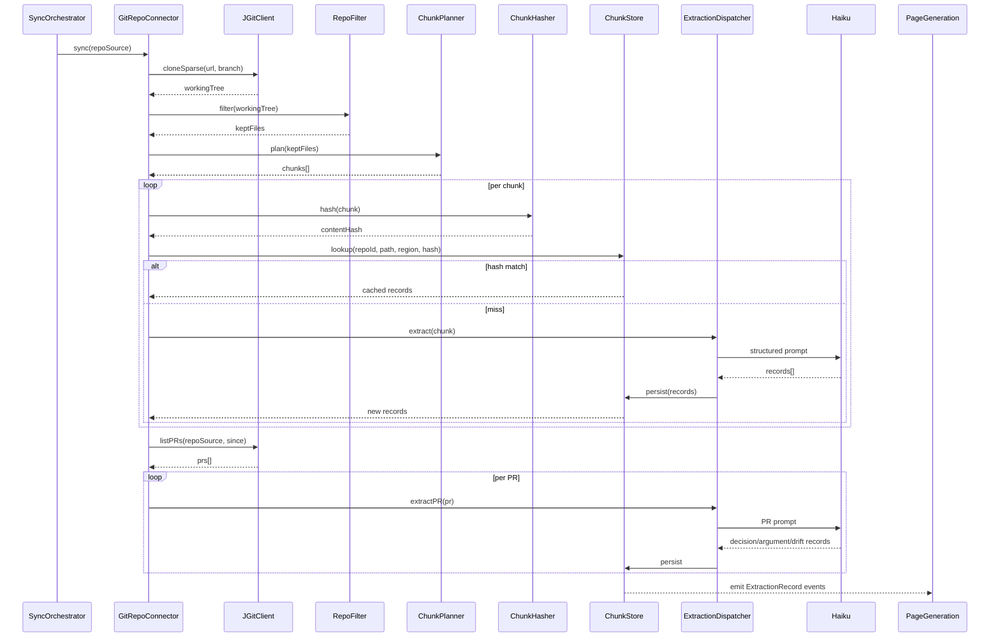

---
tags:
  - status/draft
  - priority/high
  - architecture/design
  - architecture/feature
Created: 2026-05-15
Updated: 2026-05-15
Domains:
  - "[[Wiki Engine]]"
  - "[[Data Acquisition]]"
---
# Feature: Git Repository Extraction

---

## 1. Overview

### Problem Statement

Cranium's wiki engine is only as useful as the source material it can synthesize. Git repositories (GitHub/GitLab) are the densest, highest-signal source of system knowledge a team owns — domains, features, design standards, patterns, decisions — but most of that signal is implicit (encoded in folder structure, recurring shapes, PR threads) rather than written down. Ingesting it manually does not scale, and naively shoving full files into a synthesis model is cost-prohibitive at enterprise repo sizes.

We need a deterministic, cost-controlled pipeline that walks any Git repo, programmatically extracts structural and semantic signal, lets a low-cost model (Haiku) do the language-heavy lifting, and emits structured records that the page generation layer can promote into LLM wiki pages — without re-processing unchanged regions.


**Associated Tools**
- JGit
- LLM (Haiku)

### Proposed Solution

JGit walks the repository tree. A filter layer drops noise (generated code, vendored deps, lockfiles, binaries). Files are clustered into logical chunks (by directory/module boundary) and content-hashed at the region level per the [[0. Shared Extraction Interface]] contract. Haiku then runs three structured-output extraction passes — codebase, PR/review, cross-source synthesis — emitting records that map cleanly onto wiki page kinds (`decision`, `flow`, `feature`, `interaction`, `insight`).

### Success Criteria

- [ ] Extracts: domains, features/functionalities, design standards, patterns, PR-driven decisions from any GitHub/GitLab repo
- [ ] Mid-size repo (~2k files post-filter) extracts under $10 LLM spend, under 15 minutes wall time
- [ ] Enterprise monorepo (~50k files) extracts under $250 with logical-boundary chunking
- [ ] Drift sync re-processes ≤ 20% of regions per week (hash-skip rest)
- [ ] Extraction records survive round-trip into wiki pages without losing source citations
- [ ] Conforms to `SourceConnector` interface defined in [[0. Shared Extraction Interface]]

---

## 2. Data Model

### New Entities

| Entity | Purpose | Key Fields |
| ------ | ------- | ---------- |
| `RepoSource` | Identifies a Git repo + auth + scope. One per registered repository. | `id`, `provider` (github/gitlab), `url`, `default_branch`, `auth_ref`, `include_globs`, `exclude_globs`, `last_synced_sha`, `last_synced_at` |
| `ExtractedChunk` | Smallest re-syncable unit. A file region or a PR thread. | `id`, `repo_source_id`, `chunk_kind` (file / dir-summary / pr / pr-comment-thread), `path`, `region` (line range or `<whole-file>`), `content_hash` (sha256), `last_extracted_at`, `tokens` |
| `ExtractionRecord` | A structured fact emitted by Haiku for a chunk. | `id`, `chunk_id`, `record_kind` (domain / feature / pattern / standard / decision / interaction), `payload` (JSON), `confidence`, `model`, `prompt_version` |
| `RepoSyncJob` | Tracks one full extraction run. | `id`, `repo_source_id`, `started_at`, `finished_at`, `chunks_total`, `chunks_skipped_by_hash`, `chunks_extracted`, `cost_usd`, `status` |

### Entity Modifications

| Entity | Change | Rationale |
| --- | --- | --- |
| `WikiPage` | Add `source_records: List<ExtractionRecord.id>` (already partially present via `sources:` frontmatter) | Lets page generation trace each claim back to a specific extraction record + chunk for drift propagation |
| `SourceConnector` registry | Register `GitRepoConnector` implementation | Required by [[0. Shared Extraction Interface]] |

### Data Ownership

- `RepoSource`, `ExtractedChunk`, `RepoSyncJob` → owned by the **Acquisition** module.
- `ExtractionRecord` → owned by **Acquisition**, consumed (read-only) by **Page Generation**.
- `WikiPage` → owned by **Page Generation**.

### Relationships

```
[RepoSource] 1---* [ExtractedChunk] 1---* [ExtractionRecord] *---* [WikiPage]
     |
     1---* [RepoSyncJob]
```

### Data Lifecycle

- **Creation:** `RepoSource` on user registration. `ExtractedChunk` + `ExtractionRecord` on each sync run; chunks are upserted by `(repo_source_id, path, region)`.
- **Updates:** Re-extraction only when `content_hash` changes. Records are immutable; a hash change spawns a new `ExtractionRecord` and supersedes prior ones (`superseded_by`).
- **Deletion:** Soft delete on `RepoSource` disconnect; chunks/records retained for audit until explicit purge. File deletions in the repo mark chunks as `removed=true` so downstream pages can flag drift.

### Consistency Requirements

- [x] Eventual consistency acceptable
- Acceptable delay: minutes (sync runs are batch). During inconsistency: pages cite a `content_hash` that may not match the latest chunk; `/wiki-lint` surfaces this via the L3 decay tracker (see Cranium CLAUDE.md L3).

---

## 3. Component Design

### New Components

#### `GitRepoConnector`

- **Responsibility:** Implements `SourceConnector` for Git repos. Orchestrates clone, tree walk, filter, chunking, hash-skip, extraction, record emission.
- **Dependencies:** `JGitClient`, `RepoFilter`, `ChunkPlanner`, `ExtractionDispatcher`, `ChunkStore`
- **Exposes to:** `SourceConnectorRegistry`, `SyncOrchestrator`

#### `JGitClient`

- **Responsibility:** Thin wrapper over JGit for clone (sparse + shallow), branch checkout, tree walk, blob read, PR/commit history fetch via provider REST (GitHub/GitLab) when JGit alone is insufficient.
- **Dependencies:** JGit, GitHub/GitLab REST clients
- **Exposes to:** `GitRepoConnector`

#### `RepoFilter`

- **Responsibility:** Drops noise before any LLM call. Rules: gitignore, binary detection, generated-code markers (`@generated`, `Code generated by`), vendor dirs (`node_modules`, `vendor`, `dist`, `build`, `target`), lockfiles, min/bundled assets, `.svg`/`.png`/`.lock`, oversized files (>200KB default).
- **Dependencies:** none
- **Exposes to:** `GitRepoConnector`, `ChunkPlanner`

#### `ChunkPlanner`

- **Responsibility:** Groups files into logical chunks bounded by directory/module, capped by token budget (~10k input tokens per chunk). Detects "logical boundaries" (top-level packages, `apps/*`, `services/*`, language-level module declarations). Emits a chunk plan with stable ordering.
- **Dependencies:** `RepoFilter`
- **Exposes to:** `GitRepoConnector`

#### `ChunkHasher`

- **Responsibility:** Computes sha256 over normalized chunk content (whitespace-collapsed, line-ending-normalized) for hash-skip dedupe. Same hash → reuse existing `ExtractionRecord`s.
- **Dependencies:** none
- **Exposes to:** `ChunkPlanner`, `ChunkStore`

#### `ExtractionDispatcher`

- **Responsibility:** Routes chunks to the right extractor (codebase / PR-review / cross-source). Runs Haiku calls in parallel with token-bucket rate limiting. Validates structured output against record schemas. Retries with backoff on schema failure.
- **Dependencies:** `HaikuClient`, `RecordSchemaRegistry`
- **Exposes to:** `GitRepoConnector`

#### `CodebaseExtractor`

- **Responsibility:** Per-chunk Haiku prompt → emits `domain`, `feature`, `pattern`, `standard` records.
- **Dependencies:** `ExtractionDispatcher`
- **Exposes to:** `ExtractionDispatcher`

#### `PRReviewExtractor`

- **Responsibility:** Per-PR Haiku prompt over PR body + diff summary + comment threads → emits `decision`, `argument`, `participant` records, plus a `drift` record when the PR touches code regions whose existing extraction records contradict the PR's stated decision.
- **Dependencies:** `ExtractionDispatcher`, GitHub/GitLab REST clients
- **Exposes to:** `ExtractionDispatcher`

#### `ChunkStore`

- **Responsibility:** Persists `ExtractedChunk` + `ExtractionRecord`. Provides hash-skip lookup. Emits change events for downstream page generation.
- **Dependencies:** Database
- **Exposes to:** all extractors, Page Generation

### Affected Existing Components

| Component | Change Required | Impact |
| --- | --- | --- |
| [[SourceConnector]] interface | Register Git as a connector type | Low — additive |
| [[Page Generation]] | Consume `ExtractionRecord` events; map record kinds → page kinds | Medium — new mapping rules |
| [[2. Source Page Generation, Region Content Hashing & Duplication Skip]] | Wire `content_hash` flow into `/wiki-lint` decay check | Low — already designed for this |

### Component Interaction Diagram



---

## 4. API Design

### New Endpoints

#### `POST /api/v1/sources/git`

- **Purpose:** Register a Git repo as a source.
- **Request:**

```json
{
  "provider": "github",
  "url": "https://github.com/org/repo",
  "default_branch": "main",
  "auth_ref": "secret://github/org-pat",
  "include_globs": ["src/**", "docs/**"],
  "exclude_globs": ["**/generated/**", "**/*.lock"],
  "extract_prs": true,
  "pr_lookback_days": 365
}
```

- **Response:**

```json
{
  "repo_source_id": "rs_01HXZ...",
  "status": "registered"
}
```

- **Error Cases:**
    - `400` — Invalid URL or globs
    - `401` — `auth_ref` resolves to invalid token
    - `409` — Repo already registered

#### `POST /api/v1/sources/git/{id}/sync`

- **Purpose:** Trigger an extraction run (manual or webhook-driven).
- **Request:** `{ "force_full": false }`
- **Response:** `{ "sync_job_id": "sj_...", "status": "queued" }`
- **Error Cases:**
    - `404` — Repo not registered
    - `429` — Sync already in progress

#### `GET /api/v1/sources/git/{id}/sync/{jobId}`

- **Purpose:** Inspect sync job status + cost.

### Contract Changes

`SourceConnector` interface gains: `connector_kind = "git"`, optional `webhook_secret` field. Backward compatible.

### Idempotency

- [x] All sync operations are idempotent. Hash-skip guarantees re-running a sync over unchanged regions is a no-op (cost: tree walk + hash compute, no LLM calls).

---

## 5. Failure Modes & Recovery

### Dependency Failures

| Dependency | Failure Scenario | System Behavior | Recovery |
| --- | --- | --- | --- |
| GitHub/GitLab API | Rate limit / 5xx | Backoff with jitter; mark job `partial`; resume from last successful chunk | Auto-resume on next sync window |
| JGit clone | Auth failure | Fail fast; surface to user via job status | User rotates `auth_ref` |
| JGit clone | Disk full / oversized repo | Abort; emit `oversized_repo` event | Operator increases sparse-checkout scope or rejects repo |
| Haiku | Schema validation fails | Retry up to 2× with stricter prompt; on 3rd failure, persist chunk as `extraction_failed`, continue job | Surface in `/wiki-lint`; manual reprompt or prompt version bump |
| Haiku | API outage | Pause dispatch; resume from queue when healthy | Automatic |
| ChunkStore (DB) | Unavailable | Sync job halts; in-flight chunks dropped (will re-hash next run) | Standard DB recovery |

### Partial Failure Scenarios

| Scenario | State Left Behind | Recovery Strategy |
| --- | --- | --- |
| Job dies mid-extraction | `chunks_extracted < chunks_total`; partial records persisted | Next sync resumes; hash-skip avoids re-cost |
| PR thread deleted between sync and extraction | Stale PR records | Next sync detects 404 → marks records `removed=true` |
| Branch force-pushed | `last_synced_sha` no longer reachable | Full re-walk; hash-skip salvages unchanged content |

### Rollback Strategy

- [x] Feature flag controlled — `acquisition.git.enabled`
- [x] Schema migrations reversible
- [x] Backward compatible — new tables only; no changes to existing schemas

### Blast Radius

If `GitRepoConnector` fails completely: Git ingestion halts. Knowledge Base Extraction (Notion/Confluence/Docs) continues unaffected. Existing pages remain usable; only drift detection on Git-sourced pages stalls.

---

## 6. Security

### Authentication & Authorization

- **Who can access:** Workspace admins register repos; the connector uses a per-repo `auth_ref` resolved from secret store.
- **Authorization model:** Resource-based (workspace → repo source).
- **Required permissions:** `sources:write` to register, `sources:sync` to trigger.

### Data Sensitivity

| Data Element | Sensitivity | Protection Required |
| --- | --- | --- |
| `auth_ref` token | Confidential | Stored in secret store; never logged; never sent to LLM |
| Repo source code | Confidential (customer IP) | Encryption at rest; LLM calls go to provider with zero-retention contract; no source ever leaves the LLM call |
| PR comments (author identities) | PII | Stored hashed unless workspace opts in to retain identities |

### Trust Boundaries

- Repo content becomes "untrusted" the moment it crosses into prompt context. Prompts must use delimiters + structured output to prevent prompt injection from a malicious comment/file.
- File paths and globs in API input are validated against a strict allowlist regex.

### Attack Vectors Considered

- [x] Prompt injection via repo content — mitigated by structured-output schema + delimiter sandwiching
- [x] Authorization bypass — all routes require workspace context
- [x] Data leakage — LLM provider zero-retention; no cross-tenant chunk sharing
- [x] Rate limiting — per-workspace concurrency cap on sync jobs

---

## 7. Performance & Scale

### Expected Load

- **Repos per workspace:** typical 5–20, enterprise up to 200
- **Sync frequency:** webhook-triggered on push (debounced) + weekly full
- **Data volume:** mid-size repo ~2k post-filter files; monorepo up to 50k

### Performance Requirements

- **Mid-size full sync:** p50 < 10 min, p99 < 20 min
- **Mid-size incremental sync:** p50 < 90 s (hash-skip dominant)
- **Cost target:** see § Cost Model below

### Scaling Strategy

- [x] Horizontal scaling possible — sync jobs are independent; chunk extraction parallelized per job
- **Bottleneck:** Haiku rate limits; mitigated by token-bucket per workspace + provider account pooling

### Caching Strategy

- Chunk-level content hash is the cache key. TTL: indefinite; invalidated by hash change only.
- Directory-summary chunks cache derived `domain` records — invalidated when any child file hash changes.

### Database Considerations

- **New indexes:** `(repo_source_id, path, region)` unique on `ExtractedChunk`; `(repo_source_id, content_hash)` for hash-skip lookup; `(chunk_id, record_kind)` on `ExtractionRecord`.
- **Query patterns:** primary access is hash-skip lookup during sync, and "all records for repo" during page generation. Both fit single-index lookups.
- **Potential N+1:** page generation must batch `ExtractionRecord` reads per repo to avoid per-record queries.

### Cost Model

Assume Haiku at ~$1/MTok input, ~$5/MTok output.

| Pass | Inputs | Output | Per-call cost | Calls / mid-size repo | Sub-total |
| --- | --- | --- | --- | --- | --- |
| File-level extraction (batched 10 files/call) | ~12k in | ~1.5k out | ~$0.020 | ~80 | ~$1.60 |
| Directory/cluster synthesis | ~10k in | ~2k out | ~$0.020 | ~50 | ~$1.00 |
| Pattern cross-file | ~10k in | ~1k out | ~$0.015 | ~30 | ~$0.45 |
| PR/review pass (1y of PRs) | ~5k in | ~0.8k out | ~$0.009 | ~500 | ~$4.50 |
| **Mid-size full sync total** | | | | | **~$7.50** |
| **Mid-size incremental (≤15% changed)** | | | | | **~$1.20** |
| **Enterprise monorepo (post-filter ~20k files, 5y PRs)** | | | | | **~$80–250** |
| **Enterprise weekly drift sync** | | | | | **~$5–25** |

Levers: aggressive filter (–50–70% files), batch files per call (5×), embedding-based dedupe before LLM, reserve Sonnet only for cross-file pattern synthesis where signal/cost justifies.

---

## 8. Observability

### Key Metrics

| Metric | Normal Range | Alert Threshold |
| --- | --- | --- |
| `sync_job.duration_seconds` (p99, mid-size) | < 1200 | > 1800 |
| `sync_job.cost_usd` (mid-size) | < $10 | > $25 |
| `chunks.hash_skip_ratio` (incremental) | > 0.7 | < 0.5 |
| `extraction.schema_failure_rate` | < 1% | > 5% |
| `haiku.tokens_per_second` | within rate budget | > 80% of budget sustained |
| `prompt_injection.suspicious_score` | < 0.05 | > 0.1 |

### Logging

| Event | Level | Key Fields |
| --- | --- | --- |
| `sync.started` | INFO | `repo_source_id`, `job_id`, `branch`, `head_sha` |
| `chunk.extracted` | DEBUG | `chunk_id`, `record_count`, `tokens_in`, `tokens_out`, `latency_ms` |
| `chunk.hash_skip` | DEBUG | `chunk_id`, `prior_records` |
| `extraction.schema_failure` | WARN | `chunk_id`, `attempts`, `validation_errors` |
| `sync.finished` | INFO | `job_id`, `cost_usd`, `chunks_extracted`, `chunks_skipped`, `duration_s` |

### Tracing

One root span per `RepoSyncJob`. Child spans: `clone`, `filter`, `plan`, then one span per chunk with extraction subspans. PR pass is a sibling subtree.

### Alerting

| Condition | Severity | Response |
| --- | --- | --- |
| Sync cost > 2× p95 for repo size class | Warn | Investigate prompt drift / new generated code |
| Schema failure rate > 5% | Warn | Pin prompt version; review recent prompt changes |
| Sync job stuck > 1 h | Page | Check Haiku availability + DB health |
| Prompt-injection score > threshold | Warn | Quarantine chunk; manual review |

---

## 9. Testing Strategy

### Unit Tests

- [x] `RepoFilter` rules: include/exclude globs, generated-code markers, binary detection
- [x] `ChunkHasher` normalization stability (whitespace, line endings) — same logical content → same hash across OSes
- [x] `ChunkPlanner` token cap respected, stable ordering, directory boundary preserved
- [x] `ExtractionDispatcher` retry/backoff on schema failure
- [x] Edge cases: empty repo, single-file repo, all-binary repo, repo with one giant file

### Integration Tests

- [x] End-to-end sync against fixture repos (small, monorepo-shaped, generated-heavy)
- [x] Hash-skip correctness: run twice, second run makes zero LLM calls
- [x] PR extraction against a recorded GitHub fixture (no live API)
- [x] Schema round-trip: emitted records validate against `RecordSchemaRegistry`

### End-to-End Tests

- [x] Happy path: register → sync → records → pages generated → pages cite chunks with correct hashes
- [x] Force-push / branch-rename: previous hashes invalidated correctly
- [x] Auth rotation mid-sync: job retries with new token

### Load Testing

- [x] Required — synthetic 50k-file repo to validate enterprise budget and time targets

---

## 10. Migration & Rollout

### Database Migrations

1. Create `repo_sources`, `extracted_chunks`, `extraction_records`, `repo_sync_jobs` tables with indexes from § 7.
2. Add `source_records` column to `wiki_pages` (nullable, backfill not required).

### Data Backfill

No existing data; net-new feature. Backfill happens organically as workspaces register repos.

### Feature Flags

- **Flag name:** `acquisition.git.enabled` (per workspace)
- **Rollout strategy:** internal dogfood (Cranium repo itself) → 3 design partners → general availability

### Rollout Phases

| Phase | Scope | Success Criteria | Rollback Trigger |
| --- | --- | --- | --- |
| 1 | Cranium repo only (dogfood) | Full sync under target cost; pages match human spot-check on 20 sampled records | Cost > 3× target OR schema-failure > 10% |
| 2 | 3 design partner repos (incl. one monorepo) | Each repo syncs under size-class budget; drift sync runs unattended for 2 weeks | Any partner reports incorrect or missing high-value records |
| 3 | GA behind flag | Self-serve registration works; p99 latency in spec | Sustained cost regressions across workspaces |

---

## 11. Open Questions

> [!warning] Unresolved
> 
> - [ ] Where to draw the line between "extracted by Git connector" vs "extracted by Knowledge Base connector" when an ADR lives both in repo (`/docs/decisions/`) and Confluence — likely Git wins; Confluence merge step adds context only
> - [ ] Should `PRReviewExtractor` use Haiku or step up to Sonnet for threads > 30 comments? Cost vs signal tradeoff
> - [ ] How to handle force-push history rewrites — preserve prior `ExtractionRecord`s as historical evidence or hard-delete?
> - [ ] Granularity for "pattern" detection — file-pair, package-level, repo-level? Start at package-level
> - [ ] GitLab parity timeline — GitHub-first for v1, GitLab v1.1?
> - [ ] How to attribute "design standard" records when the same pattern appears across multiple repos in one workspace — repo-scoped or workspace-scoped record?

---

## 12. Decisions Log

| Date | Decision | Rationale | Alternatives Considered |
| --- | --- | --- | --- |
| 2026-05-15 | Use JGit (not shell `git`) | Embeddable in JVM; stream-friendly tree walk; same process as extractor | Shell out to `git`, GitHub GraphQL only |
| 2026-05-15 | Default to Haiku for per-chunk extraction | Cost target requires it; signal density per chunk is high enough that Haiku suffices | Sonnet everywhere (3–5× cost), Haiku + selective Sonnet escalation (kept as future lever) |
| 2026-05-15 | Hash chunks at region level, not file level | Enterprise files can be huge with localized changes; region hashing maximizes skip ratio | Whole-file hashing (simpler but worse skip ratio) |
| 2026-05-15 | PR extraction is opt-in per repo | Highest cost / variable signal; let teams enable when ROI is clear | Always on, never run, run only on flagged PRs |
| 2026-05-15 | Filter generated/vendored code aggressively pre-LLM | Cuts cost 50–70%; generated code adds no design signal | Let LLM ignore it (wasteful) |

---

## 13. Implementation Tasks

- [ ] Define `ExtractionRecord` JSON schemas per `record_kind`
- [ ] Implement `JGitClient` (sparse clone, tree walk, blob read)
- [ ] Implement `RepoFilter` with rules + tests against fixture repos
- [ ] Implement `ChunkPlanner` + `ChunkHasher` (normalization rules locked)
- [ ] Implement `CodebaseExtractor` prompt + structured-output validation
- [ ] Implement `PRReviewExtractor` prompt + GitHub REST integration
- [ ] Implement `ChunkStore` with hash-skip lookup and event emission
- [ ] Wire `GitRepoConnector` into `SourceConnectorRegistry` per [[0. Shared Extraction Interface]]
- [ ] Build migrations + indexes
- [ ] Build sync orchestrator API endpoints
- [ ] Add observability (metrics, logs, traces, alerts)
- [ ] Build fixture-based integration test suite + synthetic load test
- [ ] Dogfood on Cranium repo end-to-end
- [ ] Design-partner rollout

---

## Related Documents

- [[0. Shared Extraction Interface]]
- [[Knowledge Base Extraction]]
- [[2. Source Page Generation, Region Content Hashing & Duplication Skip]]
- [[Wiki Engine — Pipeline Overview]]

---

## Changelog

| Date | Author | Change |
| ---- | ------ | ------ |
| 2026-05-15 | Jared | Initial draft expanded from stub |
